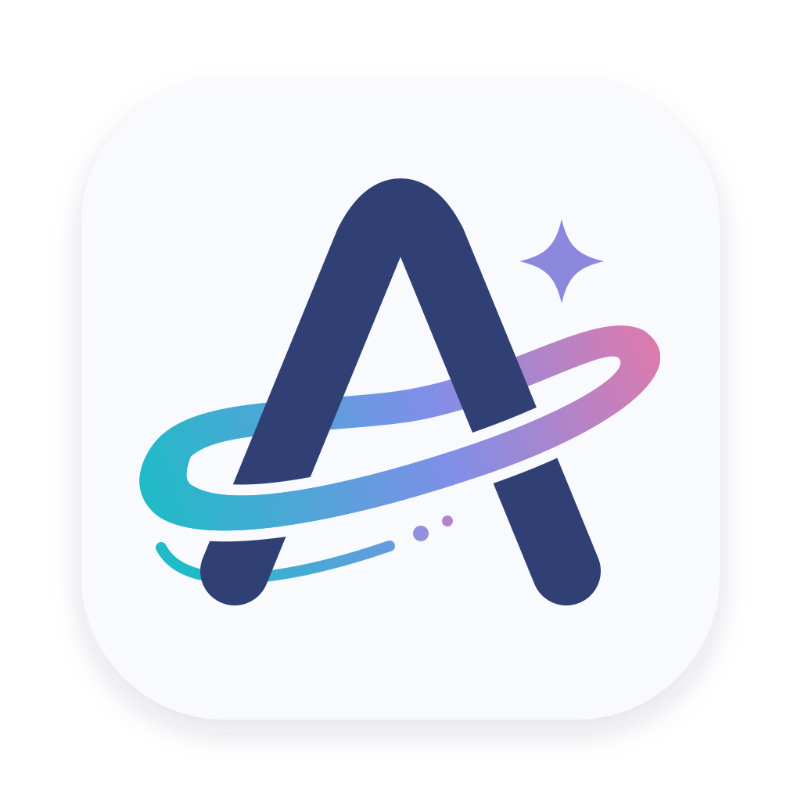

  

# AstrLink

把你的 AI 订阅和 API 提供商接入一个本地网关，让 IDE、命令行工具和 AI Agent 共用模型、路由与隐私设置。

AstrLink 是一款开源桌面应用。在界面中添加API 提供商、选择模型，再把客户端连接到本机 API 地址即可使用。支持 macOS、Windows 和 Linux。

[开始使用](#开始使用) · [API 提供商接入指南](docs/guides/pay-as-you-go-providers.md) · [桌面设置](apps/desktop/README.md) · [参与开发](CONTRIBUTING.md)

## 可以用它做什么

- **集中管理API 提供商**：连接 Codex、Claude、Grok 订阅、New API 网关、主流厂商 API 和 Coding Plan，管理多个账号与密钥。
- **统一客户端入口**：提供 OpenAI Responses、Chat Completions、Anthropic Messages 和 Gemini 接口；根据API 提供商能力配置协议转换。
- **选择模型与路由**：使用模型别名、API 提供商优先级和失败重试；也可以安装本地分类模型，为自动路由选择目标模型。
- **保护请求中的敏感信息**：通过本地规则或本地隐私模型识别敏感内容，选择提醒、拦截或脱敏，并配置响应中的占位符还原。
- **排查调用问题**：查看请求记录、会话轨迹、上游尝试和错误原因，了解请求实际走向了哪个API 提供商和模型。
- **查看使用情况**：按API 提供商、模型和客户端令牌查看用量及费用估算。估算结果不替代API 提供商账单。

网关和隐私检测运行在本机；推理请求仍会发送到你配置的上游API 提供商。模型是否可用、额度和计费取决于对应账号或 API 提供商。

## 安装

项目处于早期开发阶段，目前尚未发布正式安装包。已发布版本会放在 [Releases](https://github.com/Calcium-Ion/AstrLink/releases)。

现在可以从源码运行，步骤见 [开发与构建](CONTRIBUTING.md)。也可以在 [Actions](https://github.com/Calcium-Ion/AstrLink/actions) 中下载成功运行产生的构建产物（需要登录 GitHub）；这些属于开发构建，可能尚未签名或公证。

| 平台 | 安装包与要求 |
| --- | --- |
| macOS | Apple Silicon / Intel，macOS 13.4 或更新版本 |
| Windows | x64 `.exe` 安装程序；安装过程中可能需要下载 WebView2 |
| Linux | x64 `.deb`，Debian 12 或兼容的新版本发行版 |

隐私模型和路由分类模型按需下载或导入，安装包不包含模型权重。

## 开始使用

### 1. 添加API 提供商

打开 AstrLink，确认网关已启动，然后进入 **API 提供商 → 添加API 提供商**。

| 你已有的API 提供商 | 接入方式 |
| --- | --- |
| Codex、Claude、Grok 订阅 | 选择对应订阅类型，按界面提示完成账号授权；Grok 使用 Device Code 登录 |
| New API 或其他兼容网关 | 填写API 提供商地址和该API 提供商的 API Key |
| OpenAI、Anthropic、Gemini、DeepSeek、千问、Kimi、GLM、MiniMax、豆包、xAI | 在按量付费 API 中选择厂商，再填写开放平台密钥 |
| OpenCode Go、Kimi Coding、GLM Coding Plan、MiniMax Coding Plan | 选择对应 Coding Plan，使用订阅专用凭据 |

保存后检查API 提供商的模型列表，拉取或手动添加需要使用的模型。**模型列表为空的API 提供商不会处理推理请求。** API 和 Coding Plan 的密钥、地址可能不同，详细说明见 [API 提供商接入指南](docs/guides/pay-as-you-go-providers.md)。

### 2. 创建客户端令牌

在 **访问令牌** 中为客户端创建一个令牌。客户端填写的是 AstrLink 令牌；API 提供商的 API Key 保存在「API 提供商」中。

建议给不同工具分配不同令牌，方便查看用量和单独撤销访问。

### 3. 连接客户端

从 AstrLink 的概览或设置中复制当前 API 地址。默认地址是 `http://127.0.0.1:8317`；端口被占用时可能变化，以界面显示为准。

以使用 Chat Completions 的 OpenAI 兼容客户端为例：

| 客户端设置 | 填写内容 |
| --- | --- |
| Base URL | `http://127.0.0.1:8317/v1`，按当前实际端口调整 |
| API Key | 刚创建的 AstrLink 访问令牌 |
| Model | API 提供商模型列表中的模型 ID，或已配置的模型别名 |

不同客户端对 Base URL 的要求可能不同：有的自动追加 `/v1`，有的要求填写完整接口。常用请求路径如下：

| 接口格式 | 请求路径 |
| --- | --- |
| OpenAI Responses | `/v1/responses` |
| OpenAI Chat Completions | `/v1/chat/completions` |
| Anthropic Messages | `/v1/messages` |
| Gemini | `/v1beta/models/{model}:generateContent` |

API 提供商必须支持客户端使用的接口格式，或配置可用的协议转换。连接成功后，在 **请求记录** 中确认请求结果。

### 4. 按需设置路由和隐私策略

- 在 **路由** 中配置模型别名、目标API 提供商和重试行为。使用 `astrlink/auto` 前，先完成自动路由的分类模型和目标配置。
- 在 **安全策略** 中选择检测方式和处理动作，先用试运行检查效果，再用于日常请求。本地模型需要先下载或导入。
- 在 **路由** 中开启同一会话优先复用 API 提供商；可在请求记录中审计绑定或重新选择，详见 [会话复用与绑定审计](docs/guides/provider-stickiness.md)。
- 请求正文捕获默认关闭；排查问题时可以按需开启，并留意正文中可能包含的敏感内容。

## 常见问题

**客户端提示认证失败？**

确认填写的是仍然有效的 AstrLink 访问令牌。如果请求记录显示上游返回 401 或 403，再检查对应API 提供商的密钥或订阅登录状态。

**找不到模型或没有可用API 提供商？**

检查API 提供商是否启用、模型列表是否包含该模型，以及入口协议是否匹配。使用模型别名时，还需检查路由目标。

**启动后无法连接原来的端口？**

查看界面显示的当前 API 地址。默认端口被占用时，AstrLink 会改用空闲端口；修改设置中的端口后需要重启网关。

**开启隐私模型后请求被拒绝？**

检查模型是否安装完成、策略是否配置正确，以及请求记录中的错误。模型不可用时，请求不会跳过检测继续发送。

**关闭窗口后客户端还能用吗？**

取决于关闭窗口的设置。隐藏到托盘时网关继续运行；退出应用会停止网关。更多说明见 [桌面设置](apps/desktop/README.md)。

## 反馈与贡献

欢迎通过 [Issues](https://github.com/Calcium-Ion/AstrLink/issues) 反馈问题。请提供操作系统、应用版本、复现步骤和经过脱敏的错误信息，避免提交密钥、访问令牌或私人请求正文。

想修改代码或自行构建，请阅读 [参与开发](CONTRIBUTING.md)。

## 许可证

AstrLink 的自有源码采用 [Apache-2.0](LICENSE) 许可证，第三方组件保留各自的许可证和署名。

Core 使用的 [RelayKit](https://github.com/QuantumNous/new-api/tree/main/relaykit) 采用 AGPL-3.0。分发包含它的构建或通过网络提供相应服务时，还需遵守该依赖的许可条款。
